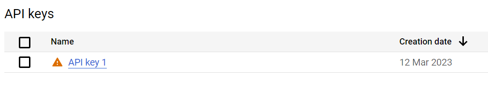
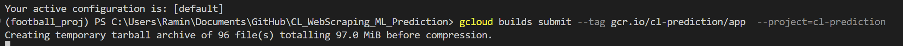
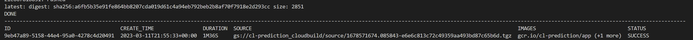
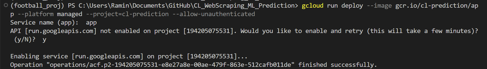
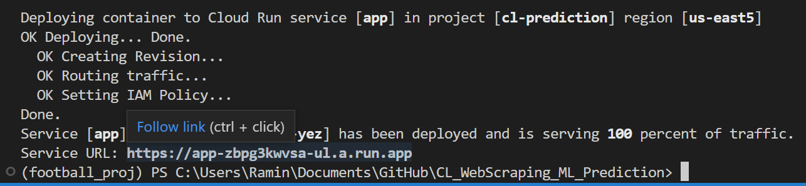

# Predicting champions league matches using web data

## Motivation
A sports TV channel has asked us to come up with predictions for upcoming UEFA Champions League matches. They would like to know if a team is favoured to win or lose, and what are the main factors associated with the prediction. 

## Goal
In this project we scrape statistics tables for each Champions League season and try to predict the results of the future games using ML.

## Running the Project

- The model can be run via webapp written in streamlit. Here is the [link](https://cl-prediction.herokuapp.com/).
- Alternatively, create an environment using the requirements.txt file provided, and run each of the notebook in the order below. You can run them individually as well since the data used for ech notebook is already in the directory. 

## File Descriptions:

get_data_new -- The  notebook will scrape all the web for th stats in the game. Timing measures are implemented to avoid being banned by the website. The result of this notebook is already saved as "all_seasons.csv". So you would not need to re-scrape the whole data just to run the project.

data_cleaning -- This will clean the redundant columns and encode categorical columns to be used for machine learning.

display_dataframe -- This notebook is used to generate the dataframe used fr displaying purposes in the streamlit app.

prediction -- Prediction on a team wining based on the chosen features. Two algorithms are used and tuned. Random Forrest classifier and XGBoost. The one with the best percision results is sent to the app.

app.py -- The streamit app that we can deploy to the cloud.

## Deployment:

- Create a project in GCP. 
- build the project from your repository as below:

- Deploy the project, I use choice 30 given my location. 

Given GCP charges money to keep the project running, I have also deployed in this cheaper platform [here](https://cl-prediction.herokuapp.com/):

Note: The cleanest way of implementing the get_data stage i.e. playwright usage would be to use in in jupyter notebook. However, playwright async does not run on windows for the reasons mentioned [here](https://github.com/scrapy-plugins/scrapy-playwright#known-issues). As a result I implement the data scraping part in .py and then move to jupyter notebok for parsing and cleaning etc.
